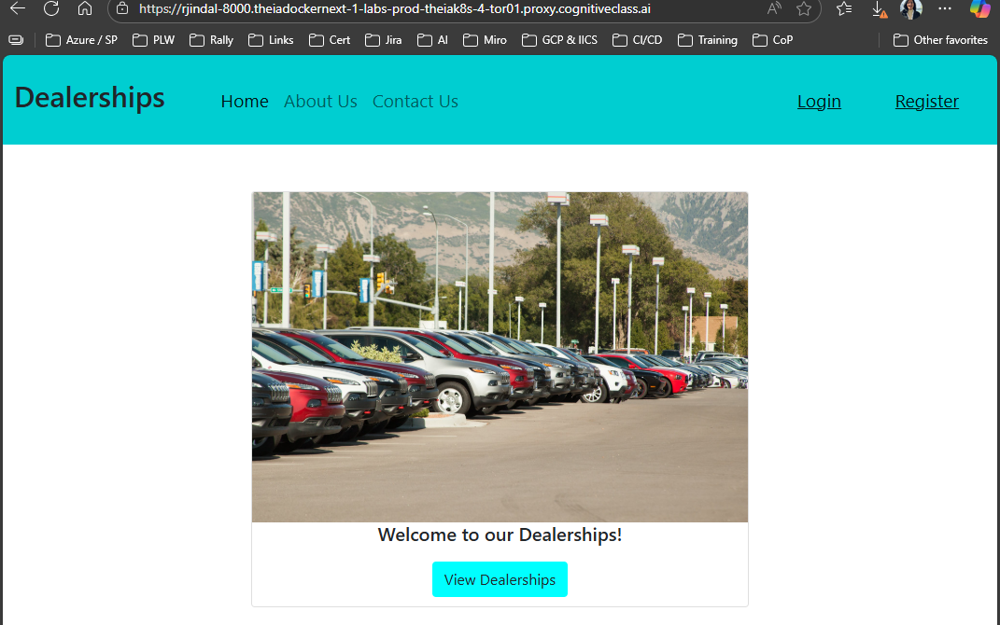
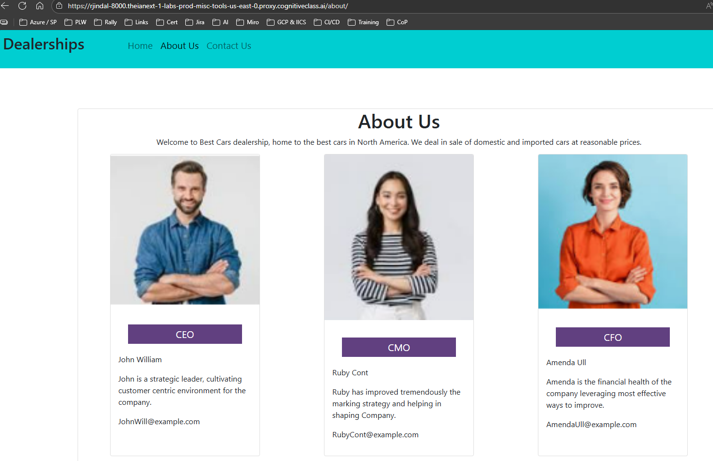
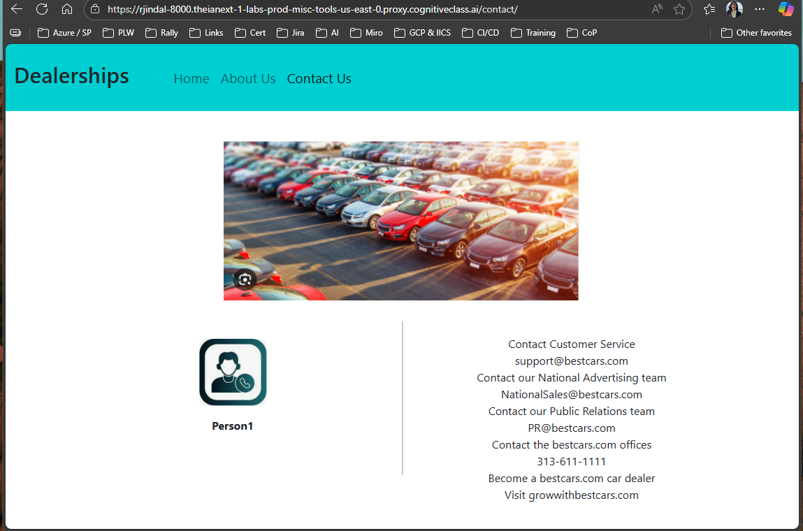
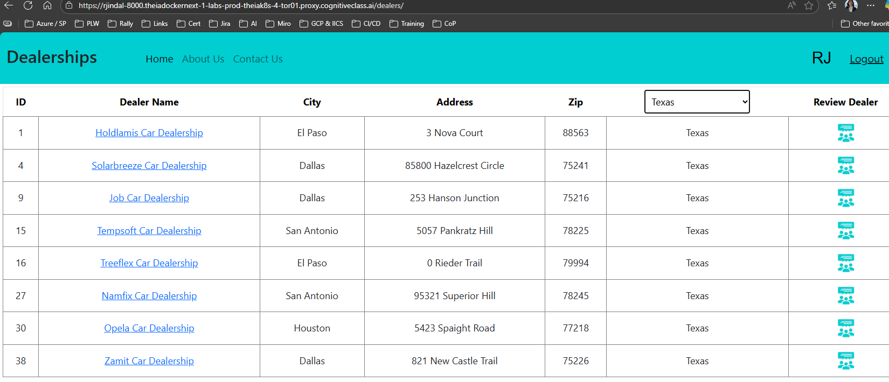
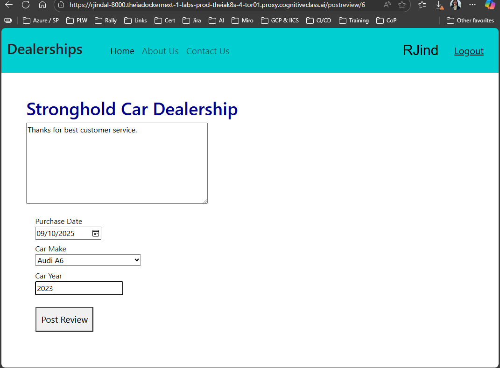
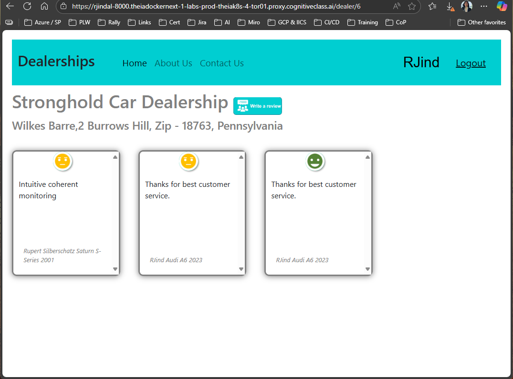

# 🚗 Car Dealership Network - Full Stack Application

A **full-stack car dealership platform** built with Django, React, Node.js, and MongoDB featuring dealership discovery, customer reviews, and AI-powered sentiment analysis.


## 🚀 Project Overview

Full-stack microservices application that enables users to explore car dealerships, read and post reviews, and discover vehicle inventory across different locations. Features Django REST API, React frontend, Node.js microservice, and AI-powered sentiment analysis.

**Key Technologies:** Django | React | Node.js | MongoDB | NLTK | Docker

## 📋 Features

**Core Functionality:**
- 🏢 **Dealership Directory** - 50+ dealerships across multiple states with location-based search
- 🚗 **Vehicle Inventory** - Car catalog with make/model management and search filters  
- 📝 **Review System** - Customer reviews with AI sentiment analysis (NLTK/VADER)
- 👤 **User Management** - Registration, authentication, and profile management
- 📱 **Responsive Design** - Mobile-optimized interface with Bootstrap styling

### 🎯 Live Application Demo



*Main landing page with dealership directory access*

### 📸 Application Screenshots

#### Company Information


*About us page showcasing company leadership and mission*



*Contact information and customer service details*

#### Dealership Search & Filtering


*Filter dealerships by state with comprehensive dealer information*

#### Review System with Sentiment Analysis


*Customer review submission with car details and purchase information*



*AI-powered sentiment analysis displaying positive, negative, and neutral review classifications*

## 🏃‍♂️ Quick Start

**Prerequisites:** Python 3.9+, Node.js 18+, MongoDB 7.0+

```bash
# Clone repository
git clone https://github.com/RitaJind/xrwvm-fullstack_developer_capstone.git
cd xrwvm-fullstack_developer_capstone

# Start services (in separate terminals)
# Django backend
cd server && pip install -r requirements.txt && python manage.py runserver

# Node.js database service  
cd server/database && npm install && docker-compose up -d && node app.js

# Sentiment analysis
cd server/djangoapp/microservices && pip install -r requirements.txt && python app.py

# React frontend
cd server/frontend && npm install && npm start
```

**Endpoints:** Frontend: http://localhost:3000 | Backend: http://localhost:8000 | Database: http://localhost:3001

##  Application Flow

**User Journey:** Homepage → Dealership Listings → Dealer Details → Vehicle Inventory → Review System → User Account

**Admin Features:** Dealership Management, Inventory Control, Review Moderation, User Management, Analytics Dashboard

## 🏗️ Architecture

**Microservices:** React SPA ↔ Django API ↔ Node.js API ↔ MongoDB + Sentiment Analysis Service (Flask/NLTK)

**Tech Stack:** Django 5.0+ | React 18+ | Node.js 18+ | MongoDB 7.0+ | Python 3.9+ | Docker

##  API Documentation

**Key Endpoints:**
- `GET /djangoapp/get_dealers/` - Fetch all dealerships
- `GET /djangoapp/get_dealers/{state}/` - Fetch dealerships by state  
- `POST /djangoapp/add_review/` - Submit a new review
- `POST /djangoapp/login/` - User authentication
- `GET /dealerships` - Node.js: Get all dealerships
- `POST /reviews` - Node.js: Add new review
- `POST /analyze/{text}` - Sentiment analysis

## 🧪 Testing

```bash
# Backend testing
cd server && python manage.py test djangoapp

# Frontend testing  
cd server/frontend && npm test

# API testing
curl -X GET http://localhost:8000/djangoapp/get_dealers/
```

## 👨‍💻 About the Developer

**Rita Jindal** - Full Stack Developer  

*Passionate about building modern, user-friendly web applications with clean code and efficient architecture. Experienced in React ecosystem, state management, and responsive design principles.*
